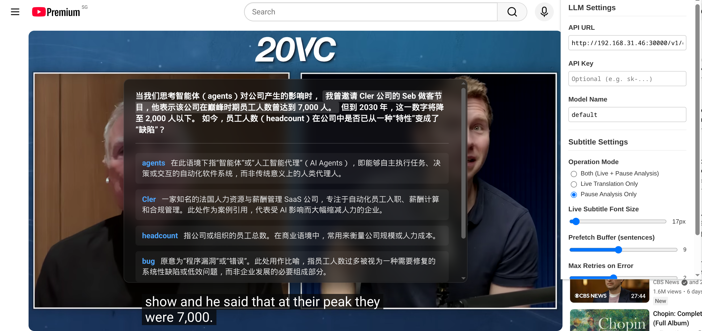

# YoutubeLLMTranslator

> 注：本项目的所有代码均由 AI 自动生成并构建。

YoutubeLLMTranslator 是一款适用于基于 Chromium 浏览器的扩展程序。它通过连接本地或云端的大语言模型（LLM），在观看 YouTube 视频时提供实时翻译与深度的上下文解析，帮助用户更好地理解视频内容和学习外语。

## 核心功能

- **暂停深度解析 (Pause & Analyze)**
  这是本插件的核心功能。在观看视频时，如遇到难以理解的句子，只需按下空格键暂停播放，插件会立即在屏幕中央显示当前字幕的深度解析面板。
  - **精准高亮**：在生成的中文段落翻译中，精准高亮当前屏幕上正在显示的英文残句所对应的中文意思，实现“所见即所指”。
  - **百科与词汇提取**：结合视频上下文，智能提取生词、短语，以及出场人物、地名等专有名词的背景解释。
  - **零延迟预加载**：利用后台预加载队列，提前将后续字幕发送给 LLM 进行翻译缓存，确保暂停时解析内容瞬间展现。

- **实时双语字幕**
  支持在 YouTube 原生播放器界面叠加由大语言模型生成的实时翻译字幕。

- **灵活的模型配置**
  支持接入任何兼容 OpenAI API 格式的大模型服务。用户可以在设置面板中自由配置 API URL、API Key 与 Model Name。不论是本地部署的模型服务（如 vLLM/Ollama），还是云端 API，均可无缝对接。

- **结构化输出与容错机制**
  - **严格的 JSON Schema**：利用大模型的结构化输出能力，强制约定返回数据格式，避免解析崩溃。
  - **异常自动重试**：内置网络波动或解析异常时的自动重试逻辑，并提供手动重试按钮以应对服务端异常。

## 安装说明

1. 打开任意基于 Chromium 的浏览器（如 Google Chrome, Edge, Brave 等），访问扩展管理页面 `chrome://extensions/`。
2. 开启右上角的 **开发者模式 (Developer mode)**。
3. 点击左上角的 **加载已解压的扩展程序 (Load unpacked)**，选择本项目的文件夹目录。
4. 建议将本插件固定在浏览器工具栏，以便快速访问设置面板。

## 使用配置

点击浏览器工具栏的插件图标，打开配置面板：

- **API URL:** 填写你的大模型接口地址（默认：`http://localhost:30000/v1/chat/completions`）。
- **API Key:** 若你的后端服务需要鉴权，请填写对应的 Token。
- **Model Name:** 指定需要调用的模型名称（默认：`default`）。
- **Operation Mode:** 根据需求选择工作模式（“仅暂停分析”、“仅实时翻译”或“两者开启”）。
- **Prefetch Buffer:** 设置后台预翻译的句子数量。缓冲值越大，暂停解析的缓存命中率越高。

配置完成后，打开任意带有字幕流的 YouTube 视频，按下空格键暂停即可体验。

## 隐私声明

本插件为纯前端运行结构，所有数据与视频字幕仅在你配置的 API 接口与本地浏览器之间直接传输，不包含任何遥测或数据收集代码。
